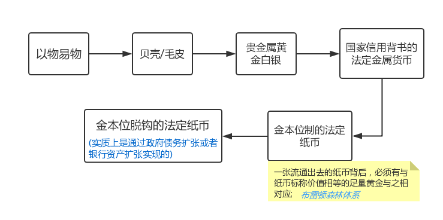

# 货币

## 1. 货币的本质
- 货币的本质:在交易过程中充当交易媒介的一般等价物.

- 货币的功能:充当交易媒介，可以用来进行价值度量, 储值工具.
## 2. 货币的发展过程

注:[布雷顿深林体系](https://zh.wikipedia.org/zh/%E5%B8%83%E9%9B%B7%E9%A1%BF%E6%A3%AE%E6%9E%97%E4%BD%93%E7%B3%BB)

### 2.1 现代信用货币的产生
#### 2.1.1 复式记账法
Asset（资产）= Liability（负债）+ Equity（股东权益）

简单例子:
1. 老王用100万人民币，创建公司A

    公司现金资产增加100万，Debit

    所有者权益增加100万，Credit

2. 公司A购买了5万元的服务器

    Asset中的现金减少5W，Credit

    Asset中的固定资产增加5W, Debit

3. 公司A向XX购买了5万元的服务器,打的借条没给现金

    Asset中的现金不变

    Asset中的固定资产增加5万, Debit

    Liability（负债）增加了5万

#### 2.1.2 商业银行货币派生

>中国目前的银行体制采用的是从1984年后开始实行的央行与商业银行两级银行体制。央行指的是中国人民银行，它位于整个金融体系的中心，负责制定和实施货币政策、对金融进行监督管理，央行是国家机关，同时它也是银行的银行，就是央行能够向商业银行贷款，同时商业银行能够向央行存款；商业银行是企业，一种只和钱打交道的特殊企业，通过存款、贷款、汇兑、储蓄等方式开展信用中介的企业，它在业务上受央行的监督和管理。既然是企业就有所有制差别，所以商业银行又分为五大国有银行（工行、农行、中行、建行、交行），若干股份制银行（中兴、招商、浦发、民生等），少量民营银行（北京银行、南京银行、宁波银行等).

先有存款再有贷款?

简化模型:  
假设全国只有两家银行，一个央行，一个商业银行A。为便于计算，假定央行规定商业银行的存款准备金率为20%。

1.央行存入100万元到A银行  
对银行而言，存款相当于银行从别人那里借了一笔钱暂时存在银行这里，银行是债务人，说明客户存款在银行这里是债务的一种，因此存款应该记录在负债端。这时，右侧负债端记账“存款100万元”。按照复式记账原则，左侧资产端同时发生变化，银行因为客户存款进来，资产发生了变化，一方面要向央行上交存款准备金，另一方面剩下的钱作为银行的超额准备金随时可以放贷。所以资产栏记账为“法定存款准备金20万元（100*0.2=20）”，“超额准备金80万元（100-20=80）”.

<table width="460">
    <h5>A银行资产负债表(单位:万元)</h5>
        <tr>
            <th width="230" align="left" colspan="2">资产(贷)</th>
            <th width="230" align="left" colspan="2">负债(借)</th>
        </tr>
        <tr>
            <th align="left">超额准备金</th>
            <th align="right">80</th>
            <th align="left">存款</th>
            <th align="right">100</th>
        </tr>
        <tr>
            <th align="left">存款准备金</th>
            <th align="right">20</th>
            <th align="left"></th>
            <th align="right"></th>
        </tr>
        <tr>
            <th align="left">总计</th>
            <th align="right">100</th>
            <th align="left">总计</th>
            <th align="right">100</th>
        </tr>
    </table>

2.A银行第一次向客户发放贷款80万  
对银行而言，贷款是银行给别人借钱，自己是债权人，而债权属于资产的一种，因此贷款应该记录在资产端。这时，左侧资产端记账“贷款80万元”。按照复式记账原则，右侧存款派生增加80万。注意!这里是关键，因为贷款增加，资产总量增加，对应负债也要增加，表现在派生出等额的存款。所以商业银行通过发放贷款来派生存款是货币创造的最为传统的方式。当贷款发生时，由于贷款不会被立即取现，就相当于贷款人将贷到的钱存在了自己银行的账户里，所以贷款产生的同时，就相当于存款同步等额产生。于是，存款变为180万（100+80=180），存款准备金变为36万（180*0.2=36），因此超额准备金变为64万（180-80-36=64）。

<table width="460">
    <h5>A银行资产负债表(单位:万元)</h5>
        <tr>
            <th width="230" align="left" colspan="2">资产(贷)</th>
            <th width="230" align="left" colspan="2">负债(借)</th>
        </tr>
        <tr>
            <th align="left">贷款</th>
            <th align="right">80</th>
            <th align="left" valign="top" rowspan="3">存款</th>
            <th align="right" valign="top"  rowspan="3">100+80</th>
        </tr>
        <tr>
            <th align="left">超额准备金</th>
            <th align="right">64</th>
        </tr>
        <tr>
            <th align="left">存款准备金</th>
            <th align="right">36</th>
        </tr>
        <tr>
            <th align="left">总计</th>
            <th align="right">180</th>
            <th align="left">总计</th>
            <th align="right">180</th>
        </tr>
    </table>

3.A银行第二次向客户发放贷款80万  
资产端贷款变为144万（80+64=144），与此同时，负债端的存款增加变为244万（180+64=244），因为存款增加，所以存款准备金变为48.8（244*0.2=48.8），那么超额准备金就剩下51.2万（244-144-48.8=51.2）。
<table width="460">
    <h5>A银行资产负债表(单位:万元)</h5>
        <tr>
            <th width="230" align="left" colspan="2">资产(贷)</th>
            <th width="230" align="left" colspan="2">负债(借)</th>
        </tr>
        <tr>
            <th align="left">贷款</th>
            <th align="right">80+64=144</th>
            <th align="left" valign="top" rowspan="3">存款</th>
            <th align="right" valign="top"  rowspan="3">100+80+64</th>
        </tr>
        <tr>
            <th align="left">超额准备金</th>
            <th align="right">51.2</th>
        </tr>
        <tr>
            <th align="left">存款准备金</th>
            <th align="right">48.8</th>
        </tr>
        <tr>
            <th align="left">总计</th>
            <th align="right">224</th>
            <th align="left">总计</th>
            <th align="right">224</th>
        </tr>
    </table>
...  

资产和负债端的总金额达到最大值，这个值恰好等于初始存款的(1/r)倍,r=存款准备金率.
____
[银行挤兑](https://baike.baidu.com/item/%E9%93%B6%E8%A1%8C%E6%8C%A4%E5%85%91):大量的银行客户因为金融危机的恐慌或者相关影响同时到银行提取现金，而银行的储备不足以支付，所出现的情况就叫银行挤兑。

#### 2.1.3 货币流动性
&ensp;&ensp;**“货币流动性”是指M1/M2，反映的是货币在市场上的投放量。**

&ensp;&ensp;M0、M1、M2是货币供应量的范畴。我国现阶段也是将货币供应量划分为三个层次，其含义分别是：

>M0：流通中现金，即在银行体系以外流通的现金；

>M1：狭义货币供应量，即M0+企事业单位活期存款；

>M2：广义货币供应量，即M1+企事业单位定期存款+居民储蓄存款。

在这三个层次中，M0与消费变动密切相关，是最活跃的货币；
M1反映居民和企业资金松紧变化，是经济周期波动的先行指标，流动性仅次于M0；
M2流动性偏弱，但反映的是社会总需求的变化和未来通货膨胀的压力状况，通常所说的货币供应量，主要指M2。

- *货币流动性过剩*: 指货币数量远远超出货币需求，过多的货币追逐较少的商品，同时在货币数量剧增状况下，货币资金为追求高额利润必然脱离实际生产体系，疯狂操作大宗商品。
- *货币流动性紧缩*: 指由于外生的货币供给低于内生的货币需求，
导致有支付能力的消费需求和投资需求不足，经济增长率偏低，社会生产低于生产
可能性边界的现象及其内在规律。

*参考*:
[[百度百科.货币流动性](https://baike.baidu.com/item/%E8%B4%A7%E5%B8%81%E6%B5%81%E5%8A%A8%E6%80%A7)]
[[MBA.wiki货币流动性](https://wiki.mbalib.com/wiki/%E8%B4%A7%E5%B8%81%E6%B5%81%E5%8A%A8%E6%80%A7)]

#### 2.1.4 流动性调节工具
1.短期调节工具
